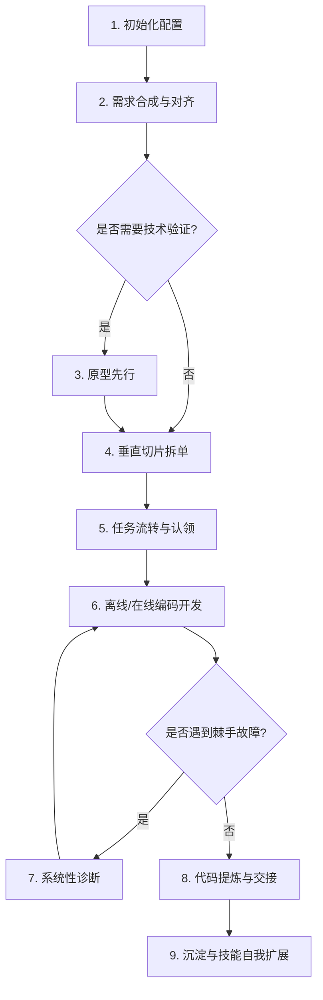

# Matt Pocock 智能体工程技能指南 (Matt-Pocock-Skills Guide)

本指南详细介绍了本仓库中安装的 14 个核心 **Matt Pocock 智能体工程技能 (Agent Skills)**。这些技能是 AI 智能体与人类开发者之间高效协作的“系统级契约”，规范了智能体在面对特定工程任务时的行为准则、工作流以及输出格式。

---

## 目录

1. [caveman — 极简野人沟通模式](#1-caveman--极简野人沟通模式)
2. [diagnose — 系统性缺陷诊断与调试](#2-diagnose--系统性缺陷诊断与调试)
3. [grill-me — 交互式设计与思路对齐](#3-grill-me--交互式设计与思路对齐)
4. [grill-with-docs — 结合项目文档的交互对齐](#4-grill-with-docs--结合项目文档的交互对齐)
5. [handoff — 跨会话上下文交接](#5-handoff--跨会话上下文交接)
6. [improve-codebase-architecture — 代码库架构改进](#6-improve-codebase-architecture--代码库架构改进)
7. [prototype — 抛弃型原型设计验证](#7-prototype--抛弃型原型设计验证)
8. [setup-matt-pocock-skills — 初始化智能体技能配置](#8-setup-matt-pocock-skills--初始化智能体技能配置)
9. [tdd — 测试驱动开发](#9-tdd--测试驱动开发)
10. [to-issues — 垂直切片任务拆解与发布](#10-to-issues--垂直切片任务拆解与发布)
11. [to-prd — 对话需求合成 PRD](#11-to-prd--对话需求合成-prd)
12. [triage — 问题与缺陷状态机分类](#12-triage--问题与缺陷状态机分类)
13. [write-a-skill — 新增智能体技能](#13-write-a-skill--新增智能体技能)
14. [zoom-out — 宏观架构鸟瞰](#14-zoom-out--宏观架构鸟瞰)

---

## 1. caveman — 极简野人沟通模式
* **核心作用**：在不丧失任何技术精确度的前提下，过滤所有废话、客套话和冠词，将智能体响应的 Token 占用削减 75% 左右。
* **最佳使用时机**：当网络卡顿、Token 额度紧张，或者人类开发者希望快速阅读结论时。
* **典型触发指令**：用户说 `"caveman mode"`、`"talk like caveman"`、`"less tokens"`、`"be brief"` 或输入 `/caveman` 时触发。输入 `"stop caveman"` 或 `"normal mode"` 退出。
* **工作流与规则**：
  - 智能体采用简短字词或短语片段进行表述（如使用“大”代替“详尽的”，“修”代替“实现一个解决方案”）。
  - 省略所有冠词（a/an/the）、连词、废话（just/really/basically）和客套话（sure/happy to）。
  - 缩写常用词（DB、auth、config、req、res、fn、impl），使用 `->` 表示因果关系。
  - **例外**：遇到安全警告、破坏性操作确认或步骤极度复杂的顺序说明时，智能体会临时退出该模式以保证人身和系统安全，随后自动恢复。

---

## 2. diagnose — 系统性缺陷诊断与调试
* **核心作用**：指引智能体不盲目猜测 Bug 成因，以严密的科学实证闭环解决疑难杂症。
* **最佳使用时机**：当单元测试或集成测试失败、系统抛出异常，或遇到难以定位的性能退化时。
* **典型触发指令**：用户说 `"diagnose this"`、`"debug this"`、报告测试报错或直接提交一段崩溃日志时。
* **工作流步骤**：
  1. **重现 (Reproduce)**：编写能在本地 100% 重现该 Bug 的最小测试或运行脚本。
  2. **最小化 (Minimize)**：剔除其他业务代码干扰，将 Bug 发生路径收敛到最简。
  3. **提出假设 (Hypothesize)**：基于代码调用和报错日志列出可能的缺陷诱因。
  4. **插桩测试 (Instrument)**：在核心执行分支插入特定的 Trace 日志或临时断言，检验假设。
  5. **修复 (Fix)**：实施“最小改动（Surgical Edit）”的代码修复。
  6. **回归测试 (Regression Test)**：运行所有测试，证明该 Bug 被消除，且没有引发新的 Regression。

---

## 3. grill-me — 交互式设计与思路对齐
* **核心作用**：通过连续且专注的逐问逐答，帮用户梳理模糊的需求，将复杂的系统设计拆解至双方达成共识。
* **最佳使用时机**：在一项重大功能开发前，或者当用户给出含糊的设计大纲需要细化时。
* **典型触发指令**：用户输入 `/grill-me`，或提出“帮我理一下这个思路，拷问我”。
* **工作流与规则**：
  - **一次只问一个问题**，不把问题扎堆抛给用户。
  - 每个问题智能体都必须给出其“推荐的备选方案”，方便用户快速做选择题而非问答题。
  - 如果问题可以通过自主阅读代码库来解答，智能体绝不打扰用户，必须自己去阅读。

---

## 4. grill-with-docs — 结合项目文档的交互对齐
* **核心作用**：在 `grill-me` 的基础上，深入结合本仓库的 `CONTEXT.md`（项目术语表/通用语言）和 `docs/adr/`（架构决策记录）进行“拷问”与约束。
* **最佳使用时机**：涉及核心业务逻辑设计，需要确保新思路与现有项目名词、历史决策高度统一时。
* **典型触发指令**：在大型设计对齐中涉及底层业务领域知识时自动启用，或由智能体在规划设计时使用。
* **工作流与规则**：
  - **捍卫术语一致性**：若用户使用的词汇与 `CONTEXT.md` 冲突，智能体必须当场纠正并澄清。
  - **具象场景拷问**：构造极端业务用例来挑战用户提出的抽象设计。
  - **交叉验证代码**：验证用户的设想与现有 Go 逻辑是否冲突，并摆出代码证据。
  - **即时更新**：一旦某个术语在拷问中对齐，**立即**修改 `CONTEXT.md`。仅在改变成本高、设计非直觉且涉及真实取舍时才提议建立 `ADR`。

---

## 5. handoff — 跨会话上下文交接
* **核心作用**：将当前的会话进度、未完结的任务、已达成的决定压缩成一份交接文档，让下一轮对话的智能体能够零启动成本地接管工作。
* **最佳使用时机**：当上下文过长需要重开会话，或者当前智能体即将结束 turn，需要交代后续工作时。
* **典型触发指令**：用户或智能体发起 `/handoff` 动作时。
* **工作流与规则**：
  - 生成交接文档并保存到系统临时目录中（不污染本仓库工作区）。
  - 引用已有的 PRD、Plan 或 Git Commit URL，**不重复**抄录这些已固化的内容。
  - 脱敏敏感信息（API Key、密码等）。
  - 指明下一个会话的重点，并附带 **建议调用的技能 (Suggested Skills)** 列表。

---

## 6. improve-codebase-architecture — 代码库架构改进
* **核心作用**：静态分析代码库，寻找架构坏味道，优化依赖，提升代码的可测试性与智能体可读性。
* **最佳使用时机**：阶段性重构、消除技术债、或者在进行大型功能扩展前评估系统承载力时。
* **典型触发指令**：用户要求“改进架构”或“做代码库设计审计”时。
* **工作流与规则**：
  - 寻找“深模块（Deep Modules）”，即那些将复杂业务逻辑包裹在极简、且极少发生变动的 API/函数接口之下的设计。
  - 评估 Go 包的封装边界（如 `internal/` 的隔离性），防止跨包越权访问。
  - 比对当前的依赖调用，确保其与 `docs/adr/` 中约定的设计大方向一致。

---

## 7. prototype — 抛弃型原型设计验证
* **核心作用**：用最快速度编写一段“抛弃型代码”来回答某一个关键的技术或界面疑问，用实物代替空谈。
* **最佳使用时机**：当某一模块设计（如复杂状态机）在纸面上难以推演，或者不确定某种 UI 布局视觉效果是否足够惊艳时。
* **典型触发指令**：用户说 `"prototype this"`、`"let me play with it"`、`"try a few designs"`。
* **工作流与规则**：
  - **分流选择 (Branch)**：根据问题归入“逻辑验证分支”（构建交互式终端命令行 App 跑状态机例程）或“UI/视觉验证分支”（在一个独立 Route 上生成几种迥异的 UI 变体，通过底部浮动栏切换）。
  - **快速且不加修饰**：零持久化（数据保存在内存中）、零多余抽象、不做错误处理、不写单元测试，目标是回答疑问后即刻删除或吸收。
  - **暴露状态**：每一次交互动作后必须将当前完整状态渲染或打印出来。

---

## 8. setup-matt-pocock-skills — 初始化智能体技能配置
* **核心作用**：初始化或重置项目中的智能体辅助配置，确保所有工程技能能够与本仓库的 Issue Tracker、Triage 标签、以及领域文档目录对齐。
* **最佳使用时机**：在新克隆的仓库中初次和 AI 智能体协作时，或计划切换缺陷跟踪管理工具时。
* **典型触发指令**：用户输入 `/setup-matt-pocock-skills` 触发。
* **工作流与规则**：
  - 分析本地的 Git 远端、`CLAUDE.md`/`AGENTS.md` 和文档目录。
  - 向用户确认：1. 问题追踪器类型（GitHub/GitLab/本地 Markdown/其他）；2. Triage 的 5 个状态角色对应标签名；3. 领域文档结构（单/多上下文）。
  - 确认后，自动在 `CLAUDE.md` 中追加 `## Agent skills`，并在 `docs/agents/` 目录下生成映射契约文件。

---

## 9. tdd — 测试驱动开发
* **触发场景**：实现具体的 Bug 修复或功能迭代时。
* **核心价值**：强制采用“红-绿-重构”闭环，保证每一行进入生产环境的代码都是由测试用例催生出来的。
* **典型触发指令**：用户要求使用“TDD 模式”、“红绿重构”或“写测试先于代码”时。
* **工作流步骤**：
  1. **编写测试 (Red)**：根据新需求或缺陷，在 `tests/` 目录下编写测试用例。运行它并必须亲眼看到其报错或失败。
  2. **快速实现 (Green)**：在 `internal/` 中以最简单甚至粗暴的逻辑使该测试通过。
  3. **精心重构 (Refactor)**：重构实现代码，消除坏味道，遵守 Go 语言格式化与命名规范，并在重构后保证测试依旧为 Green。

---

## 10. to-issues — 垂直切片任务拆解与发布
* **核心作用**：将一个大型实现计划或 PRD，拆解为可独立开发、独立交付并可由 AI 离线（AFK）完成的“垂直切片” Issues。
* **最佳使用时机**：当 PRD 被用户批准，准备进入多步任务执行阶段时。
* **典型触发指令**：用户或智能体要求“把 Plan/PRD 拆解为 issues 并发布”时。
* **工作流与规则**：
  - **垂直切片 (Tracer Bullet)**：每一个子 Issue 必须是一条打通数据库、API 契约、页面和单元测试的极薄纵向切片，严禁按“水平分层”拆分（如把“写 Schema”和“写前端”拆成不同 issue）。
  - **人机隔离**：明确标注每个切片是 HITL（需要人机对齐/人工介入）还是 AFK（AI 可自主编码合并）。
  - **用户确认**：在发布前向用户展示切片清单与拓扑依赖关系，对齐粒度。
  - **拓扑发布**：按照依赖顺序从前往后调用 `gh` 发布，从而可以在后面的 issue 描述里直接引用前置 issue 编号。

---

## 11. to-prd — 对话需求合成 PRD
* **核心作用**：合并当前的对话共识与技术现状，合成一份产品需求文档（PRD）并发布到 Issue 追踪器上。
* **最佳使用时机**：在一项功能的业务讨论完结，进入开发拆解前。
* **典型触发指令**：用户说“为此功能生成一份 PRD”或触发 `/to-prd` 时。
* **工作流与规则**：
  - 智能体通过自我思索与探索自动整理，**不通过长篇采访打扰用户**。
  - 寻找并定义业务中的深模块接口。
  - 编写包含问题、解决方案、详尽的用户故事（User Story）列表、实现决策（不含具体文件路径和代码）、测试决策和超出范围（Out of scope）的标准 PRD 文档。
  - 使用 `ready-for-agent` 标签将其发布到 Issue 追踪器中。

---

## 12. triage — 问题与缺陷状态机分类
* **核心作用**：通过命令对 Issue 追踪器中的待处理项进行评估、分类并推进其状态流转。
* **最佳使用时机**：当有新 Issue 进站，或者定期做任务 Backlog 理顺时。
* **典型触发指令**：用户输入 `/triage`，或描述 `"Move #42 to ready-for-agent"` 等指令时。
* **工作流与规则**：
  - 执行 `triage` 技能的所有输出注释中，必须第一行挂载声明：`> *This was generated by AI during triage.*`。
  - 为指定 Issue 评估 `Category` 角色（`bug`/`enhancement`）和 `State` 状态，并推动流转。
  - 流转到 `ready-for-agent` 时必须附带规范的 **智能体简报 (Agent Brief)**；流转到 `needs-info` 时必须输出标准的 `Triage Notes` 提问模板。

---

## 13. write-a-skill — 新增智能体技能
* **核心作用**：在项目中开发或定制全新的智能体技能。
* **最佳使用时机**：当前项目引入了全新技术栈或特定流程，需要让未来的智能体严格遵守相关约束时。
* **典型触发指令**：用户指示“创建一个新技能”或“编写一个 Skill”时。
* **工作流步骤**：
  1. **收集需求**：向用户明确新技能的覆盖域、使用场景、是否需要辅助的可执行脚本。
  2. **编写技能结构**：创建 `skill-name/` 文件夹，编写 `SKILL.md`（说明文件长度控制在 100 行内，超过则拆分到 REFERENCE.md / EXAMPLES.md 中）。
  3. **编写 Description**：必须在 YAML Frontmatter 中编写极度清晰的 Description，因为这是智能体加载时唯一能看见的选择依据。第一句说明作用，第二句以 `"Use when [特定触发器]"` 开头。
  4. **校验清单**：校验是否包含 concrete 用例，是否无时间敏感信息等。

---

## 14. zoom-out — 宏观架构鸟瞰
* **核心作用**：命令智能体脱离当前的微观代码行，重返顶层抽象层，为开发者提供当前模块的架构图与调用关系脑图。
* **最佳使用时机**：开发者进入一个庞大且陌生的新包，难以看清当前的函数和文件是为哪个主业务流服务时。
* **典型触发指令**：用户输入 `/zoom-out` 或提示“Zoom out and explain”。
* **工作流与规则**：
  - 智能体暂停深入细节，使用项目通用术语绘制出当前包与 callers 的架构图或思维导图。
  - 给出当前核心 Go 模块（Controller、Service、Repository）在整个请求生命周期中的工作流站位。

---

## 最佳实践：如何串联并使用这些 Skill（典型协作流程）

在实际的项目开发周期中，这 14 个技能通常不是孤立运行的，而是相互配合、交替触发，以形成一条**高确定性、高覆盖率的“垂直交付闭环”**。以下是官方推荐的最佳实践开发流程：

### 步骤 1：初始化协作环境 (Initialize)
* **执行技能**：[setup-matt-pocock-skills](#8-setup-matt-pocock-skills--初始化智能体技能配置)
* **实践做法**：在首次导入本仓库或变更管理工具时，率先运行一次 `/setup-matt-pocock-skills`。这保证了智能体在后续使用 `to-issues`、`triage` 和 `to-prd` 时，能精准无误地知道如何调用 GitHub CLI，以及如何读写本地的 `CONTEXT.md` 业务文档。

### 步骤 2：产品需求共识 (Clarify)
* **执行技能**：[to-prd](#11-to-prd--对话需求合成-prd) $\rightarrow$ [grill-me](#3-grill-me--交互式设计与思路对齐) / [grill-with-docs](#4-grill-with-docs--结合项目文档的交互对齐)
* **实践做法**：
  1. 开发者在聊天区描述想要完成的业务功能，并与智能体反复讨论。
  2. 智能体自发调用 `to-prd` 技能合成一份标准的 PRD，并在其中规定哪些边界属于 `Out of Scope`（避免需求蔓延）。
  3. 智能体发起 `grill-with-docs` 拷问会话，挑战开发者设计中的模糊地带，强迫其符合本项目的 `CONTEXT.md` 统一术语规范，防止编写出同义不同音的代码符号。

### 步骤 3：原型快速突破 (Optional - Prototype)
* **执行技能**：[prototype](#7-prototype--抛弃型原型设计验证)
* **实践做法**：在正式向 Go 核心库提交代码前，如果不确定某个复杂的业务状态流转是否顺畅，或者前端视觉是否惊艳，可以指示智能体“针对 X 写一个 Prototype”。快速得到一个无测试、无长久存储、仅在内存中跑的极简原型。验证假设后，立马将经验沉淀并彻底**删除**原型代码。

### 步骤 4：垂直切片拆单 (Decompose)
* **执行技能**：[to-issues](#10-to-issues--垂直切片任务拆解与发布)
* **实践做法**：在 PRD 获准后，调用 `to-issues` 启动拆单。智能体**严禁**横向分层拆单（如：仅写数据库或仅写接口），必须拆解成贯穿数据库、服务层、Fiber 路由和单元测试的**垂直切片 (Tracer Bullet)**。每个切片都要可独立运行、独立合并，并清晰区分出哪些是 AI 可全自动离线完成的 `AFK` 任务，哪些是需要人类把关的 `HITL` 任务。

### 步骤 5：看板流转分配 (Triage)
* **执行技能**：[triage](#12-triage--问题与缺陷状态机分类)
* **实践做法**：通过运行 `/triage` 指令，将前面拆分好的垂直 Issues 在状态机上推移至 `ready-for-agent`。此时，智能体会自动为该 Issue 匹配生成一份完整的“智能体简报（Agent Brief）”，告知此切片的具体业务约束和防错规则，作为离线开发的唯一输入源。

### 6. 离线/在线编码开发 (Code & Refactor)
* **执行技能**：[zoom-out](#14-zoom-out--宏观架构鸟瞰) $\rightarrow$ [tdd](#9-tdd--测试驱动开发) $\rightarrow$ [improve-codebase-architecture](#6-improve-codebase-architecture--代码库架构改进)
* **实践做法**：
  1. 智能体或开发者领取垂直 Issue 开始开发。若进入生疏的底层包，可随时调用 `/zoom-out` 鸟瞰 callers 关系。
  2. 强制使用 `tdd` 编写测试：先在 `tests/` 目录下（遵守 Zero-Coexistence 规则）写出能重现测试失败的用例，随后以最小逻辑使其通过（Green），然后安全重构。
  3. 觉得整体包层次混乱或有紧耦合隐患时，触发 `improve-codebase-architecture`，寻找能够剥离出去并进行孤立测试的“深模块（Deep Modules）”。

### 步骤 7：系统性缺陷诊断 (Debug)
* **执行技能**：[diagnose](#2-diagnose--系统性缺陷诊断与调试)
* **实践做法**：如果在绿灯阶段或持续集成（CI）里发现跑出了无法预料的 Bug，停止毫无根据的猜想，立刻启动 `diagnose` 技能。严格执行：编写 100% 重现 Bug 的微型测试 $\rightarrow$ 剔除干扰项 $\rightarrow$ 提出假设 $\rightarrow$ 插桩观察变量 $\rightarrow$ 最小侵入式修复 $\rightarrow$ 全量回归测试通过的闭环。

### 步骤 8：会话交接与上下文瘦身 (Handoff)
* **执行技能**：[handoff](#5-handoff--跨会话上下文交接)
* **实践做法**：当开发者准备休息，或者当前会话因分析了太多代码导致上下文爆满（Token 堆积）影响大模型推理速度时，开发者发起 `/handoff` 指令。智能体会自动将已决定的内容与后续任务归纳到本地临时目录中的交接文档中。开发者可放心重启一个全新的聊天，并贴入该交接内容，实现“轻装上阵”且不丢失任何逻辑进度。

---

## 辅助核心技巧：野人常驻模式 (Caveman)
在上述所有协作的讨论、拷问、拆单中，如果您觉得 AI 回复长篇大论太繁冗，可以**在任意阶段常驻开启** `/caveman` 技能。这会在整个生命周期中保持高技术精确度的同时，砍掉多余修饰语，极大加快 AI 的反应速度并为您省下可观的 Token 额度。
